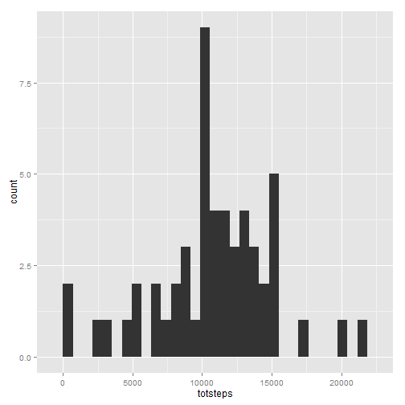
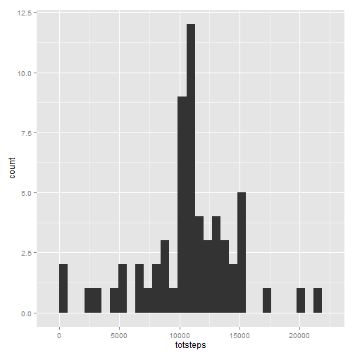
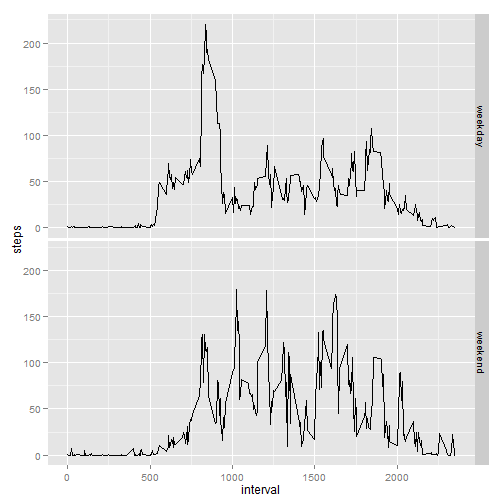

###Loading and preprocessing the data


```r
library(ggplot2)
data <- read.csv("activity.csv")
```


###What is mean total number of steps taken per day?###


```r
data1 <- aggregate(x = list(totsteps = data$steps), by = list(data$date), FUN = sum)
```


1. Histogram of the total number of steps taken each day

```r
qplot(totsteps, data = data1)
```

```
## stat_bin: binwidth defaulted to range/30. Use 'binwidth = x' to adjust this.
```

 


2. Calculate and report the mean and median total number of steps taken per day.

```r
mean(data1$totsteps, na.rm = TRUE)
```

```
## [1] 10766.19
```
Mean is 10766.19


```r
median(data1$totsteps, na.rm = TRUE)
```

```
## [1] 10765
```
And median is 10765


###What is the average daily activity pattern?

1. Time series plot of the 5-minute interval and the average number of steps taken.

```r
data2 <- aggregate(x = list(avsteps = data$steps), by = list(interval = data$interval),
                   FUN = mean, na.rm = TRUE)
qplot(x = interval, y = avsteps, data = data2, geom = "line", xlab = "5-minute interval",     
      ylab = "average number of steps") 
```

 


2. Which 5-minute interval, on average across all the days in the dataset, contains the maximum number of steps?

```r
data2$interval[which.max(data2$avsteps)]
```

```
## [1] 835
```


###Imputing missing values

1. Calculate and report the total number of missing values in the dataset (i.e. the total number of rows with NAs)

```r
nrow(subset(data, is.na(steps) | is.na(interval)))
```

```
## [1] 2304
```

2. Devise a strategy for filling in all of the missing values in the dataset.

I'm going to fill in missing values by average number of steps taken for that 5-minute interval across all days.


3. Create a new dataset that is equal to the original dataset but with the missing data filled in.


```r
#data2 contains average number of steps taken.
data3 <- data
for (i in 1:nrow(data)){
        if (is.na(data3$steps[i])){
            data3$steps[i] <- rep(data2$avsteps, 61)[i]
        }        
} 
nrow(subset(data3, is.na(steps)))
```

```
## [1] 0
```

4. Make a histogram of the total number of steps taken each day.


```r
data4 <- aggregate(x = list(totsteps = data3$steps), by = list(data3$date), FUN = sum)
data4
```

```
##       Group.1 totsteps
## 1  2012-10-01 10766.19
## 2  2012-10-02   126.00
## 3  2012-10-03 11352.00
## 4  2012-10-04 12116.00
## 5  2012-10-05 13294.00
## 6  2012-10-06 15420.00
## 7  2012-10-07 11015.00
## 8  2012-10-08 10766.19
## 9  2012-10-09 12811.00
## 10 2012-10-10  9900.00
## 11 2012-10-11 10304.00
## 12 2012-10-12 17382.00
## 13 2012-10-13 12426.00
## 14 2012-10-14 15098.00
## 15 2012-10-15 10139.00
## 16 2012-10-16 15084.00
## 17 2012-10-17 13452.00
## 18 2012-10-18 10056.00
## 19 2012-10-19 11829.00
## 20 2012-10-20 10395.00
## 21 2012-10-21  8821.00
## 22 2012-10-22 13460.00
## 23 2012-10-23  8918.00
## 24 2012-10-24  8355.00
## 25 2012-10-25  2492.00
## 26 2012-10-26  6778.00
## 27 2012-10-27 10119.00
## 28 2012-10-28 11458.00
## 29 2012-10-29  5018.00
## 30 2012-10-30  9819.00
## 31 2012-10-31 15414.00
## 32 2012-11-01 10766.19
## 33 2012-11-02 10600.00
## 34 2012-11-03 10571.00
## 35 2012-11-04 10766.19
## 36 2012-11-05 10439.00
## 37 2012-11-06  8334.00
## 38 2012-11-07 12883.00
## 39 2012-11-08  3219.00
## 40 2012-11-09 10766.19
## 41 2012-11-10 10766.19
## 42 2012-11-11 12608.00
## 43 2012-11-12 10765.00
## 44 2012-11-13  7336.00
## 45 2012-11-14 10766.19
## 46 2012-11-15    41.00
## 47 2012-11-16  5441.00
## 48 2012-11-17 14339.00
## 49 2012-11-18 15110.00
## 50 2012-11-19  8841.00
## 51 2012-11-20  4472.00
## 52 2012-11-21 12787.00
## 53 2012-11-22 20427.00
## 54 2012-11-23 21194.00
## 55 2012-11-24 14478.00
## 56 2012-11-25 11834.00
## 57 2012-11-26 11162.00
## 58 2012-11-27 13646.00
## 59 2012-11-28 10183.00
## 60 2012-11-29  7047.00
## 61 2012-11-30 10766.19
```

```r
qplot(totsteps, data = data4)
```

```
## stat_bin: binwidth defaulted to range/30. Use 'binwidth = x' to adjust this.
```

 

Calculate and report the mean and median total number of steps taken per day. 


```r
mean(data4$totsteps)
```

```
## [1] 10766.19
```

```r
median(data4$totsteps)
```

```
## [1] 10766.19
```

New mean is 10766.19
Median is also 10766.19

Do these values differ from the estimates from the first part of the assignment? 

Mean is the same, but median is slightly higher.

What is the impact of imputing missing data on the estimates of the total daily number of steps?

There is no impact of imputing missing values on the estimates of daily number of steps.


###Are there differences in activity patterns between weekdays and weekends?

1. Create a new factor variable in the dataset with two levels – “weekday” and “weekend” indicating whether a given date is a weekday or weekend day.


```r
Sys.setlocale("LC_TIME", "English")
```

```
## [1] "English_United States.1252"
```

```r
data3$date <- strptime(data3$date, format = "%Y-%m-%d")
for (i in 1:nrow(data3)){
     if (weekdays(data3$date[i], abbreviate = T) == "Sut" | weekdays(data3$date[i], abbreviate = T) == "Sun"){
        data3$day[i] <- "weekend"
     } else {
        data3$day[i] <- "weekday"
       }
}

data3 <- transform(data3, day = factor(day))
table(data3$day)
```

```
## 
## weekday weekend 
##   15264    2304
```


2. Make a panel plot containing a time series plot (i.e. type = "l") of the 5-minute interval (x-axis) and the average number of steps taken, averaged across all weekday days or weekend days (y-axis). See the README file in the GitHub repository to see an example of what this plot should look like using simulated data.


```r
data5 <- aggregate(steps ~ interval + day, data = data3, FUN = mean)
qplot(interval, steps, data = data5, geom = "line", facets = day ~ .)
```

 
